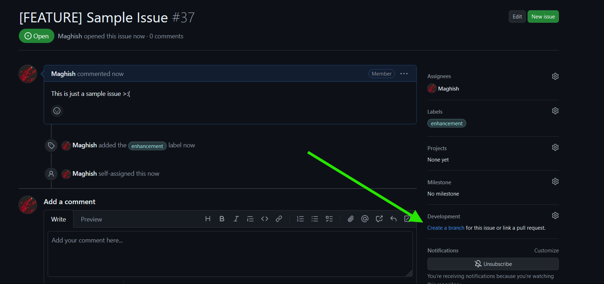

# Table of Contents

- [How to setup this repository locally?](#how-to-setup-this-repository-locally)
- [How to contribute to this repository?](#how-to-contribute-to-this-repository)
  - [Key tips and warnings](#key-tips-and-warnings)

# How to setup this repository locally?

1. First off, fork this repository.
2. Then clone the forked repository into your local system.
3. Run `npm install` to install the dependencies.

   _That's pretty much it!_

# How to contribute to this repository?

1. If you have any suggestions on something, you can just create an issue, or if you find any suitable issue that you feel you can fix and work on it.
2. Just open the issue you are going to work on, and it on the right side bottom, you will find a section named **"Development"** and under that you can see a text saying to create a branch,

   

3. Click on the **"Create a branch"** and it will open a pop-up, select the forked repository you created under the "**Repository destination**" and click **"Create branch"** to create the branch inside the repository.

4. Then go to your local system terminal and checkout to the branch

```bash
git checkout <branch-name>
```

5. Now you can work freely on that branch! Once you finished your work, just commit the changes and push it back to your forked repository and make a PR _(Pull Request)_ from there to the [main repository](https://github.com/rage-js/core).

   _Admins will soon review your code and address problems if any and then merge it to the main branch. We request you to be patient, admins may take some more time to reply but they eventually will._

## Key tips and warnings

> [!IMPORTANT]
>
> - Whenever you create a function or a class, be sure to always document it using JSDoc! and also always wrap the functions inside try-catch block to prevent errors from breaking the whole code.
> - Do not include unnecessary code like `console.log` when commiting the changes.
> - Please double check if you left mistaken any code you wrote, before creating the Pull Request.

<br>

<div align="center" >

**Thank you all once again for contributing and supporting our project!**

</div>
