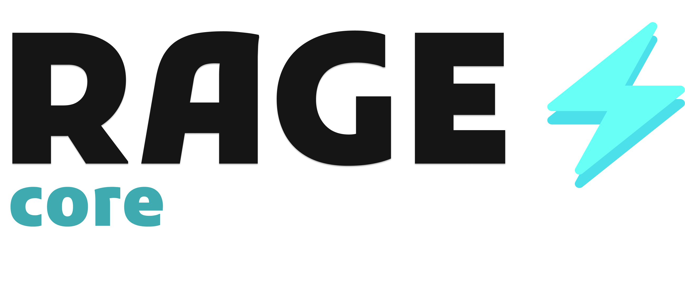

<div align='center'>
  <picture>
    <source media="(prefers-color-scheme: dark)" srcset="./img_for_docs/RAGE-core.png">
    
  </picture>
</div>

The core module of RAGE which provides the functionality for RAGE methods like **Push After Interval**, **Push On Update** and **No Interval**.

_Read the full documentation about the core module through this link: **https://github.com/rage-js/docs**_

# Table of Contents

- [Installation](#installation)
- [How to use it?](#how-to-use-it)
  - [Setup](#setup)
  - [How to use the core module manually?](#how-to-use-the-core-module-manually)

# Installation

```bash
npm install @rage-js/core
```

Run the command above to install the module.

# How to use it?

## Setup

You could use `@rage-js/cli` for that, because it's primarily built for this purpose only.

Run the following commands below:

```bash
npm install @rage-js/cli
```

```bash
npx rage
```

If you ran the above command, it will start to interact with you, provide the inputs it asks and then wait for it to create it by it's own. Once done, you can go to the directory that you gave as input, you will be able to see the main javascript file, `package.json` file and also `rage.config.json` which is the configuration file for RAGE core module.

> [!NOTE]
> If you mess up with the configuration while giving the cli the inputs, you can just go to the respective directory and search for the `rage.config.json` file and then you can edit the configuration there manually.

## How to use the core module manually?

This is the default file content that the cli will provide you:

```javascript
// Run "npm install" to install the dependencies.

const { App } = require("@rage-js/core");

const app = new App("./rage.config.json", true);

async function start() {
  await app.setup();
  await app.start();
}

start();

process.on("exit" || "SIGINT" || "SIGTERM", async () => {
  await app.stop();
  process.exit(0);
});
```

As you can see, every function in `App` class is async. Now what is `App`?

- `App` is the initializer and also the main thing that runs the core instance to run the methods, etc. When initialzing the `App`, you have to provide two parameters, one is the path to the `rage.config.json` file, while the other one is to toggle logger on or off.

  - `Setup` - You have to run `setup()` function before starting the app or doing anything else. Because that function will read the configuration file and setup it up as class variables for other functions to access later. If you ran `start()` before this function, then it shall throw an error to run `setup()` before starting the application.
  - `Start` - As the name suggests, this function starts the the `App` instance and also method instances as well. Basically the `App` will run a method instance loop that runs until `stop()` is called.
  - `Stop` - As mentioned above, this function stops the `App` instance and also method instances as well, but it also finally pushes the local json data back to the cloud database and deletes the json data files. It is recommended to add this code block below to run this function when the application is about to terminate, by the user or itself.

    ```javascript
    process.on("exit" || "SIGINT" || "SIGTERM", async () => {
      await app.stop();
      process.exit(0);
    });
    ```

<br>

<div align="center">

_Made with 💢 and Node.js_

</div>
